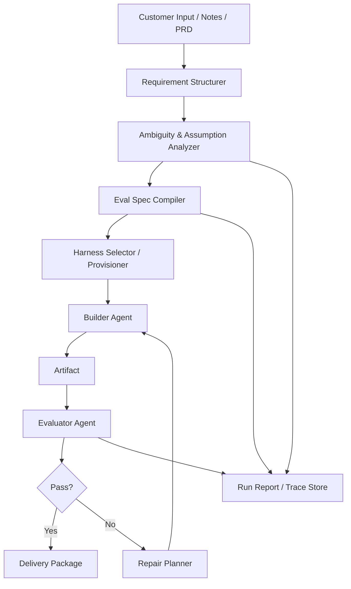

# FDE용 Evaluation-Driven Harness Agent 설계 제안서

## 1. 문서 목적

이 문서는 다음 두 가지 관점을 결합해 하나의 설계 방향으로 정리한다.

1. **FDE(Forward Deployed Engineer)의 실제 업무 맥락**  
   FDE는 고객사 현장에서 요구사항을 분석하고, 이를 빠르게 구조화한 뒤, 검증 가능한 프로토타입 서비스로 전환하는 역할을 맡는다.
2. **Harness Engineering 중심의 에이전트 설계**  
   에이전트는 웹, 앱, 백엔드/API, 문서 등 다양한 결과물을 생성할 수 있어야 하며, 각 결과물 유형에 맞는 harness를 선택 또는 구성해 실행·검증·수정 루프를 수행해야 한다.

이 문서의 핵심 제안은 다음 한 문장으로 요약된다.

> **FDE 에이전트는 단순한 프로토타입 생성기가 아니라, 고객 요구사항을 검증 가능한 계약으로 변환하고, 그 계약을 만족할 때까지 산출물을 수렴시키는 시스템이다.**

---

## 2. 배경: FDE 업무에 왜 이런 에이전트가 필요한가

FDE의 업무는 일반적인 제품 개발과 다르다. 고객이 처음부터 완성된 요구사항 문서를 제공하는 경우는 드물고, 실제 현장에서는 다음과 같은 상황이 반복된다.

- 요구사항이 모호하거나 상충된다.
- 고객은 문제를 설명하지만, 검증 기준은 명확히 말하지 못한다.
- FDE는 짧은 시간 내에 가설을 정리하고, 프로토타입을 만들고, 고객과 함께 검증해야 한다.
- 중요한 것은 “얼마나 많이 만들었는가”보다 “고객이 중요하게 여기는 기준을 만족했는가”이다.

따라서 FDE를 위한 에이전트는 단순히 코드를 생성하는 능력보다 아래 역량이 더 중요하다.

- 요구사항을 구조화하는 능력
- 모호한 요구를 검증 가능하게 번역하는 능력
- 결과물 유형에 따라 실행 환경과 테스트 환경을 빠르게 구성하는 능력
- 실패 원인을 분석하고 다음 수정 전략을 제안하는 능력
- 명확한 종료 조건 안에서 반복 개선을 수행하는 능력

---

## 3. 문제 정의

우리가 만들고자 하는 에이전트는 다음 문제를 해결해야 한다.

### 3.1 입력 문제
고객 요구사항은 보통 아래처럼 들어온다.

- “관리자가 쓰기 편해야 한다.”
- “반응 속도가 빨라야 한다.”
- “현업 프로세스에 맞아야 한다.”
- “모바일에서도 잘 보여야 한다.”

이런 표현은 사람 사이의 커뮤니케이션에는 유용하지만, 자동화된 생성과 검증의 입력으로는 불충분하다.

### 3.2 생성 문제
결과물은 하나로 고정되지 않는다.

- 웹 프로토타입
- 모바일 앱 프로토타입
- API 서버
- 데이터 파이프라인
- 운영 문서 / 설계 문서 / 보고서

따라서 하나의 범용 생성기보다 **결과물 유형별 harness 체계**가 필요하다.

### 3.3 검증 문제
가장 중요한 문제는 생성 자체가 아니라 **검증의 부재**다.  
프로토타입이 완성돼 보이더라도, 고객 요구를 만족하는지 객관적으로 말할 수 없다면 FDE 관점에서는 성공한 산출물이라 보기 어렵다.

따라서 핵심은 다음과 같다.

> **요구사항을 정량적 검증 규약으로 변환하고, 그 검증을 통과하지 못하면 수정 루프를 반복하는 구조를 시스템의 중심에 둔다.**

---

## 4. 설계 목표

### 4.1 핵심 목표

1. 고객 요구사항을 **구조화된 요구사항 스키마**로 변환한다.
2. 구조화된 요구사항을 **정량적 검증 규약(Eval Spec)** 으로 변환한다.
3. 결과물 유형별 **Harness** 를 자동 선택 또는 자동 구성한다.
4. 산출물을 생성한 뒤 **실행 가능한 검증**을 수행한다.
5. 실패한 항목에 대해 원인과 수정 전략을 도출하고 재생성/수정을 반복한다.
6. 최종적으로 FDE가 고객과 공유 가능한 형태의 결과물과 검증 리포트를 제공한다.

### 4.2 비목표

다음은 이 시스템의 1차 비목표로 두는 것이 좋다.

- 모든 고객 요구를 완전 자동으로 해석하는 것
- 완전 무인 상태에서 프로덕션급 시스템을 바로 배포하는 것
- 사람의 판단 없이 UX/브랜드/정책적 판단까지 100% 결정하는 것

이 에이전트의 목적은 “완전 자동화”보다 **FDE의 의사결정과 실행 속도를 극적으로 높이는 것**에 있다.

---

## 5. 핵심 설계 원칙

### 5.1 Requirement-first가 아니라 Evaluation-first
산출물 중심이 아니라 검증 중심으로 설계한다.

- 좋은 결과물 = 많이 만든 결과물
- 더 좋은 결과물 = **검증 가능한 요구를 만족한 결과물**

즉, 생성기는 코어가 아니다.  
코어는 **요구사항을 평가 규약으로 바꾸는 계층**이다.

### 5.2 Harness는 “결과물 유형 × 검증 목적” 단위로 본다
예를 들어 웹 harness 하나만 두는 것은 부족하다. 웹 결과물 안에서도 검증 목적에 따라 harness가 달라진다.

- 기능 구현 harness
- UI 검증 harness
- API 계약 검증 harness
- E2E 시나리오 harness
- 성능 검증 harness
- 접근성 검증 harness
- 보안/정적 분석 harness

따라서 harness는 단순한 개발 환경 세팅이 아니라, **특정 산출물 유형에 대해 특정 검증을 가능하게 하는 실행 프레임**으로 정의하는 것이 적절하다.

### 5.3 가능한 한 실행 가능한 검증을 우선한다
LLM 평가만으로는 편향이나 자기합리화가 생길 수 있다.  
따라서 평가는 우선순위를 다음처럼 두는 것이 좋다.

1. 실행 가능한 테스트
2. 정적 분석 / 계측 기반 점검
3. 휴리스틱 기반 점수화
4. 마지막 보조 수단으로 LLM 평가

### 5.4 생성자와 평가자를 분리한다
한 모델이 만들고 같은 모델이 평가하면 평가가 느슨해질 수 있다.  
따라서 최소한 개념적으로는 아래 역할을 분리한다.

- **Builder**: 산출물 생성/수정
- **Evaluator**: 테스트 실행, 채점, 실패 원인 도출
- **Orchestrator**: 루프 제어, 예산 제어, 상태 관리

### 5.5 모호성은 숨기지 말고 명시적으로 처리한다
FDE 업무에서는 모호성을 제거하는 능력이 중요하다.  
따라서 에이전트는 모호한 요구사항을 무시하지 말고 다음 중 하나로 분류해야 한다.

- 검증 가능한 규약으로 번역 가능
- 가정이 필요함
- 고객 확인이 필요함
- 현재 데이터/환경으로는 검증 불가

### 5.6 루프는 무한 반복이 아니라 수렴 제어가 있어야 한다
“통과할 때까지 계속 루프”는 이상적으로 맞지만, 실제 시스템은 다음을 함께 가져야 한다.

- 품질 종료 조건
- 시간/비용/토큰 예산
- 개선 폭 기반 수렴 조건
- 사람 개입이 필요한 escalation 조건

---

## 6. 전체 시스템 정의

### 6.1 시스템의 한 줄 정의

> **FDE용 Evaluation-Driven Harness Agent는 고객 요구사항을 분석해 정량적 검증 규약으로 변환하고, 결과물 유형별 harness를 통해 산출물을 생성·평가·수정하여 고객 요구를 만족하는 프로토타입을 수렴시키는 시스템이다.**

### 6.2 시스템이 다루는 대상

- 입력: 고객 인터뷰 메모, 회의록, PRD 초안, 기능 목록, UI 목업, 경쟁 서비스 예시, 운영 제약 조건
- 출력: 프로토타입, 실행 환경, 테스트 결과, 검증 리포트, 가정 목록, 미해결 항목 목록

---

## 7. 상위 아키텍처



### 7.1 주요 컴포넌트

#### 1) Requirement Structurer
- 고객의 자연어 요구사항을 구조화된 스키마로 변환한다.
- 기능 요구, 비기능 요구, 제약 조건, 우선순위, 미정 항목을 분리한다.

#### 2) Ambiguity & Assumption Analyzer
- 모호하거나 상충되는 요구를 감지한다.
- 검증 가능 여부를 판정한다.
- 필요한 가정과 고객 확인 포인트를 추출한다.

#### 3) Eval Spec Compiler
- 구조화된 요구사항을 정량적 검증 규약으로 변환한다.
- 각 요구에 대해 metric, threshold, severity, test method를 정의한다.

#### 4) Harness Selector / Provisioner
- 결과물 유형과 검증 목적에 따라 적합한 harness를 선택 또는 조합한다.
- 필요한 툴체인, 실행 환경, 테스트 러너, 데이터 시드, 샘플 입력을 준비한다.

#### 5) Builder Agent
- 선택된 harness 환경 안에서 초안 산출물을 생성한다.
- 평가 결과를 반영해 patch 단위 또는 module 단위 수정한다.

#### 6) Evaluator Agent
- 테스트를 실행하고 metric을 측정한다.
- pass/fail을 판정한다.
- 실패 원인과 수정 제안을 생성한다.

#### 7) Repair Planner
- 실패한 검증 항목을 우선순위화한다.
- 최소 수정으로 최대 점수 향상을 내는 변경 계획을 만든다.

#### 8) Trace / Report Store
- 어떤 요구가 어떤 테스트로 연결됐는지 추적 가능하게 저장한다.
- FDE가 고객과 공유할 수 있는 근거 자료를 만든다.

---

## 8. 핵심 개념: Requirements-to-Eval Compiler

이 시스템의 진짜 핵심은 코드 생성기가 아니라 **Requirements-to-Eval Compiler** 다.

즉, 입력으로 받은 고객 요구를 다음처럼 바꾼다.

### 8.1 예시: 모호한 요구 → 검증 가능한 요구

| 원문 요구 | 변환된 운영 정의 | 검증 방식 |
|---|---|---|
| 관리자가 쓰기 편해야 한다 | 신규 등록 핵심 작업을 3클릭 이내에 완료 가능 | E2E task test |
| 응답이 빨라야 한다 | 주요 조회 API p95 latency 800ms 이하 | 성능 테스트 |
| 모바일에서도 잘 보여야 한다 | 390px 뷰포트에서 핵심 CTA가 first fold 내 노출 | 반응형 UI 검사 |
| 현업 프로세스에 맞아야 한다 | 엑셀 업로드 후 1분 내 유효성 검사 및 실패 사유 표기 | 시나리오 테스트 |

### 8.2 중요한 포인트
요구사항을 “이해”하는 것보다 더 중요한 것은 **검증 가능하게 operationalize 하는 것**이다.  
이 단계가 부실하면 이후 harness, 생성, 수정 루프 모두 흔들린다.

---

## 9. Harness Engineering 정의

### 9.1 Harness란 무엇인가
이 문맥에서 harness는 단순한 개발 템플릿이나 boilerplate가 아니다.

> **Harness는 특정 산출물 유형에 대해, 생성·실행·검증·계측·수정이 반복 가능하도록 만드는 실행 프레임이다.**

### 9.2 Harness가 포함해야 하는 요소
모든 harness는 최소한 아래 계약을 가져야 한다.

#### 공통 입력
- 요구사항 스키마
- Eval Spec
- 기술 제약 조건
- 디자인/브랜드 제약 조건
- 테스트 데이터 또는 시드 데이터

#### 공통 실행 구성
- 런타임 및 의존성
- 빌드 명령
- 실행 명령
- 테스트 명령
- 리포트 수집 방법
- 로그 수집 방법

#### 공통 출력
- 산출물 파일
- 테스트 결과
- 성능 지표
- 스냅샷 / 스크린샷 / 로그
- 실패 원인
- 다음 수정 제안

### 9.3 Harness 분류 체계
Harness는 두 축으로 분류할 수 있다.

#### 축 1: 결과물 유형
- Web Prototype Harness
- Mobile App Harness
- Backend/API Harness
- Data Workflow Harness
- Document / Proposal Harness

#### 축 2: 검증 목적
- Functional Harness
- Contract Harness
- E2E Harness
- Accessibility Harness
- Performance Harness
- Security/Static Analysis Harness
- UX Heuristic Harness

즉, 실제 시스템에서는 하나의 산출물이 여러 harness 조합을 사용할 수 있다.

---

## 10. Web Harness 예시

웹 프로토타입을 위한 harness는 다음과 같은 구성을 가질 수 있다.

### 10.1 목표
- 관리자/사용자 플로우가 실제 클릭 가능한 형태로 동작해야 한다.
- 핵심 페이지의 반응형 UI가 유지돼야 한다.
- 주요 API 연동 또는 목(mock) 데이터 기반 흐름이 재현돼야 한다.
- 성능/접근성 최소 기준을 만족해야 한다.

### 10.2 구성 요소
- 프로젝트 scaffold 생성기
- 프론트엔드 런타임 및 패키지 매니저
- 디자인 시스템 또는 UI 컴포넌트 템플릿
- 목 API 또는 실제 API 스텁
- E2E 테스트 러너
- Lighthouse / 접근성 검사 도구
- 스냅샷 비교 도구
- 성능 계측기

### 10.3 예시 검증 항목
- 로그인, 목록 조회, 상세 조회, 수정, 저장 플로우 정상 동작
- 폼 유효성 검사 문구 노출
- 390px / 768px / 1440px 뷰포트 레이아웃 통과
- 주요 화면 Lighthouse performance 80 이상
- 접근성 최소 점수 충족
- 치명적 콘솔 에러 없음

---

## 11. Mobile App Harness 예시

앱 harness는 웹과 일부 유사하지만, 다음 차이를 고려해야 한다.

### 11.1 추가 고려 요소
- 플랫폼(iOS / Android) 차이
- 네이티브 권한 처리
- 오프라인/불안정 네트워크 상황
- 앱 설치/실행/전환 흐름
- 디바이스 크기와 해상도 다양성

### 11.2 검증 예시
- 첫 실행 온보딩 완료율
- 네트워크 실패 시 재시도 UX
- 주요 화면 렌더링 시간
- 터치 타겟 최소 크기
- 딥링크 동작 여부
- 크래시 없는 정상 플로우 비율

---

## 12. 정량적 검증 설계

### 12.1 평가 항목의 계층
모든 요구를 동일한 강도로 다루면 안 된다. 평가 항목은 다음처럼 계층화하는 것이 좋다.

#### Hard Constraints
반드시 통과해야 하는 항목

예:
- 로그인 실패 시 보안 정책 준수
- 핵심 CRUD 시나리오 성공
- 필수 API contract 일치

#### Soft Goals
최대한 높여야 하는 항목

예:
- p95 latency 800ms 이하
- 초기 로딩 시간 단축
- task completion score 향상

#### Preferences
있으면 좋은 선호 조건

예:
- 디자인 톤 앤 매너
- 카피라이팅 스타일
- 정보 밀도 선호

### 12.2 Eval Spec에 포함될 필드
각 검증 규약은 최소한 다음 필드를 가져야 한다.

- `requirement_id`
- `title`
- `type` (functional / non_functional / ux / performance / security 등)
- `metric`
- `threshold`
- `severity`
- `test_method`
- `data_setup`
- `owner`
- `retry_policy`
- `evidence`

### 12.3 예시 Eval Spec (YAML)

```yaml
project: customer-admin-prototype
artifact_type: web
requirements:
  - requirement_id: FR-001
    title: 신규 고객 등록 가능
    type: functional
    metric: e2e_task_success
    threshold: "100%"
    severity: hard
    test_method: playwright_scenario
    data_setup: seeded_admin_account
    evidence: [video, screenshot, console_log]

  - requirement_id: NFR-001
    title: 고객 목록 조회 응답 속도
    type: performance
    metric: p95_latency_ms
    threshold: "<=800"
    severity: soft
    test_method: api_benchmark
    data_setup: 1000_seeded_customers
    evidence: [latency_report]

  - requirement_id: UX-001
    title: 모바일에서 핵심 CTA 노출
    type: ux
    metric: cta_visible_above_fold
    threshold: true
    severity: soft
    test_method: responsive_snapshot_check
    data_setup: iphone12_viewport
    evidence: [screenshot]
```

---

## 13. 생성-평가-수정 루프 설계

### 13.1 기본 루프

```text
1. 요구사항 구조화
2. Eval Spec 생성
3. Harness 선택 및 환경 구성
4. 초안 산출물 생성
5. 검증 실행
6. 실패 원인 분석
7. 수정 계획 수립
8. 산출물 수정
9. 재검증
10. 종료 또는 escalation
```

### 13.2 핵심 원칙

- 실패는 “재생성”보다 “원인 기반 수정”으로 처리한다.
- 모든 실패는 requirement_id 기준으로 연결된다.
- 수정 후에는 전체 재검증보다 **영향 범위 중심 재검증 + 필수 회귀 테스트**를 수행한다.

### 13.3 종료 조건

#### 품질 종료 조건
- 모든 Hard Constraint 통과
- Soft Goal 총점이 최소 기준 이상

#### 예산 종료 조건
- 최대 반복 횟수 초과
- 시간/토큰/비용 한도 도달

#### 수렴 종료 조건
- 최근 N회 동안 개선 폭이 임계값 이하

#### 운영 종료 조건
- 외부 의사결정 없이는 더 진행 불가
- 요구사항 상충으로 자동 해결 불가

### 13.4 Escalation 조건
다음 경우에는 FDE 또는 고객 확인이 필요하다.

- 요구사항끼리 상충함
- 검증 기준 자체가 미정임
- 외부 시스템 접근 권한이 없음
- 정책/브랜드/법무 판단이 필요함
- 성능 목표가 현재 아키텍처 제약상 불가능함

---

## 14. 평가 주도 설계에서 중요한 점

이 시스템의 차별점은 “좋은 코드를 잘 짜는가”가 아니다.  
차별점은 **검증 가능한 계약을 먼저 만들고, 그 계약을 기준으로 반복 개선한다는 점**이다.

이 접근이 중요한 이유는 다음과 같다.

1. 고객과의 커뮤니케이션이 쉬워진다.  
   “좋아 보인다”가 아니라 “어떤 기준을 만족했는가”로 대화할 수 있다.

2. FDE가 산출물의 상태를 설명하기 쉬워진다.  
   완료/미완료가 아니라 “통과한 규약 / 실패한 규약 / 확인이 필요한 규약”으로 표현 가능하다.

3. 에이전트의 개선 방향이 명확해진다.  
   막연한 재생성이 아니라, 어느 항목이 실패했고 무엇을 고쳐야 하는지가 드러난다.

4. 결과물 유형이 달라도 공통 운영 모델을 유지할 수 있다.  
   웹이든 앱이든 문서든, 핵심 루프는 동일하고 harness만 달라진다.

---

## 15. 데이터 모델 초안

### 15.1 Requirement Schema

```json
{
  "requirement_id": "FR-001",
  "source": "customer_interview",
  "raw_text": "관리자가 쉽게 신규 고객을 등록할 수 있어야 한다",
  "normalized_text": "관리자는 신규 고객 등록 플로우를 짧은 단계로 완료할 수 있어야 한다",
  "category": "functional",
  "priority": "high",
  "ambiguity_level": "medium",
  "assumptions": [
    "easy는 3클릭 이내로 operationalize"
  ],
  "needs_customer_confirmation": true
}
```

### 15.2 Eval Result Schema

```json
{
  "run_id": "run_2026_04_09_001",
  "requirement_id": "FR-001",
  "status": "failed",
  "metric": "e2e_task_success",
  "observed_value": "0%",
  "expected_value": "100%",
  "severity": "hard",
  "failure_reason": "저장 버튼 클릭 후 validation error 처리가 누락됨",
  "repair_hint": "필수 필드 validation 및 오류 메시지 렌더링 추가",
  "evidence": [
    "artifacts/videos/register-flow.mp4",
    "artifacts/screenshots/register-error.png"
  ]
}
```

---

## 16. 예시 시나리오

### 16.1 고객의 원문 요구
고객사는 “영업 운영팀이 신규 리드를 빠르게 등록하고 상태를 관리할 수 있는 관리자 웹”을 원한다.

추가 요구는 아래와 같다.

- 모바일에서도 봐야 한다.
- 너무 느리면 안 된다.
- 현업이 엑셀 업로드를 많이 쓴다.
- 권한별로 메뉴가 달라야 한다.

### 16.2 구조화된 요구
- 관리자 로그인 필요
- 신규 리드 등록 가능
- 엑셀 업로드 기반 일괄 등록 가능
- 권한별 메뉴 노출 제어
- 모바일 뷰포트 지원
- 주요 목록 조회 성능 목표 존재

### 16.3 Eval Spec 예시
- 로그인 성공/실패 시나리오 통과
- 신규 리드 등록 E2E 100% 성공
- 엑셀 업로드 후 1분 내 처리 완료
- 역할(role)별 메뉴 노출 규칙 일치
- 390px 뷰포트에서 핵심 CTA 노출
- 목록 조회 API p95 800ms 이하

### 16.4 Loop 예시
1. Builder가 초기 관리자 웹 생성
2. Evaluator가 E2E와 반응형 테스트 수행
3. 모바일에서 CTA가 fold 아래로 내려가 실패
4. Repair Planner가 레이아웃 우선 수정 제안
5. Builder가 UI 수정
6. 재검증 후 반응형 항목 통과
7. 성능 항목 실패 시 API pagination / caching 개선
8. 모든 hard 항목 통과 시 결과물과 리포트 패키징

---

## 17. 운영상 리스크와 대응

### 17.1 리스크: 요구사항 자체가 검증 불가능함
예: “세련돼야 한다”, “직관적이어야 한다”  

**대응**
- operational definition 제안
- 휴리스틱 평가로 다운그레이드
- 고객 확인 필요 항목으로 승격

### 17.2 리스크: 같은 모델이 생성과 평가를 모두 맡아 자기합리화함
**대응**
- 역할 분리
- 실행 가능한 테스트 우선
- 독립된 evaluator prompt / policy 사용

### 17.3 리스크: 루프가 무한히 길어짐
**대응**
- 반복 횟수 제한
- 개선 폭 측정
- 실패 이유 유형화 후 escalation

### 17.4 리스크: harness가 결과물별로 파편화됨
**대응**
- 공통 Harness Contract 정의
- artifact_type별 템플릿 위에 목적별 validator를 플러그인 구조로 얹기

### 17.5 리스크: 고객 요구가 계속 바뀜
**대응**
- requirement versioning
- eval spec versioning
- 어떤 버전 기준으로 통과했는지 trace 저장

---

## 18. 권장 시스템 운영 모델

### 18.1 역할 분리
- **FDE**: 고객 요구 정제, 우선순위 조정, 가정 승인
- **Agent**: 구조화, 생성, 검증, 수정 제안, 리포트 생성
- **고객**: 모호한 요구 확정, trade-off 승인

### 18.2 FDE가 실제로 얻게 되는 가치
- 요구사항 정리 속도 향상
- 검증 기준이 명확한 프로토타입 생성
- 고객과의 합의 비용 절감
- 데모 품질의 일관성 향상
- 실패 원인과 미해결 항목의 투명성 확보

---

## 19. MVP 범위 제안

처음부터 모든 결과물 유형을 지원하기보다, 아래 순서로 시작하는 것이 현실적이다.

### Phase 1: Web Prototype 중심 MVP
- Requirement Structurer
- Eval Spec Compiler
- Web Harness
- E2E / 반응형 / 성능 / 접근성의 최소 검증 세트
- 수정 루프 및 리포트 생성

### Phase 2: Backend/API Harness 확장
- OpenAPI contract 검증
- 부하 테스트
- 인증/권한 테스트

### Phase 3: Mobile App Harness 확장
- 화면 흐름 검증
- 디바이스 조건 검증
- 앱 성능/크래시 기준 반영

### Phase 4: Multi-artifact Orchestration
- 웹 + API + 문서 + 데이터 workflow를 하나의 프로젝트 안에서 동시 관리
- cross-artifact dependency 추적

---

## 20. 최종 제안

정리하면, 우리가 만들고자 하는 FDE용 에이전트는 아래 특징을 가져야 한다.

1. 고객의 자연어 요구사항을 그대로 생성 입력으로 쓰지 않는다.  
   먼저 구조화하고 operationalize 한다.

2. 결과물 생성보다 **정량적 검증 규약 생성**을 더 핵심 기능으로 본다.

3. harness는 단순한 개발 템플릿이 아니라, **생성·실행·검증·수정이 반복 가능한 프레임**으로 정의한다.

4. 웹/앱 같은 결과물 유형별 harness 위에, 기능/성능/접근성/E2E 같은 검증 목적 harness를 조합한다.

5. 생성과 평가는 분리하고, 가능하면 실행 가능한 테스트를 우선한다.

6. 통과하지 못한 요구는 실패 원인과 함께 다시 수정 루프로 보내고, 루프는 품질·예산·수렴 조건 아래에서 제어한다.

7. 최종 산출물은 코드나 화면만이 아니라, **검증 리포트, 가정 목록, 미해결 항목, 고객 확인 포인트**까지 포함해야 한다.

---

## 21. 결론

이 설계의 본질은 매우 명확하다.

> **FDE 에이전트는 프로토타입을 잘 만드는 에이전트가 아니라, 고객 요구사항을 검증 가능한 계약으로 바꾸고, 그 계약을 만족할 때까지 산출물을 수렴시키는 에이전트다.**

따라서 harness engineering에서 가장 중요한 포인트를 하나만 고르자면, 그것은 단순한 환경 자동화가 아니라 다음이다.

> **요구사항 → 정량적 검증 규약 → harness 실행 → 평가 → 수정 루프**를 끊기지 않게 연결하는 것이다.

이 구조가 갖춰지면 FDE는 더 빠르게 고객 요구를 구조화할 수 있고, 더 짧은 시간 안에, 더 설명 가능한 방식으로, 더 신뢰할 수 있는 프로토타입을 제시할 수 있다.

---

## 22. 현재 문서의 가정

이 문서는 아래 가정을 두고 작성되었다.

- 1차 대상은 내부 설계 정리 및 팀 공유용 문서다.
- 초기 MVP는 웹 프로토타입 중심으로 시작하는 것이 현실적이다.
- 에이전트의 성공 기준은 “많이 생성했는가”보다 “검증 규약을 만족했는가”에 있다.
- 사람(FDE)의 개입은 제거 대상이 아니라, 고난도 판단을 담당하는 상위 레이어로 유지한다.

---

## 23. 다음 단계 제안

실제 설계로 이어가려면 다음 세 가지를 먼저 고정하는 것이 좋다.

1. **Requirement Schema**  
   어떤 형식으로 고객 요구를 구조화할 것인가

2. **Eval Spec Schema**  
   어떤 형식으로 정량적 검증 규약을 표현할 것인가

3. **Harness Contract**  
   모든 harness가 공통으로 따라야 하는 입력/실행/출력 계약은 무엇인가

이 세 가지가 고정되면, 이후 웹 harness, 앱 harness, evaluator, repair planner는 비교적 일관된 구조로 확장 가능하다.
