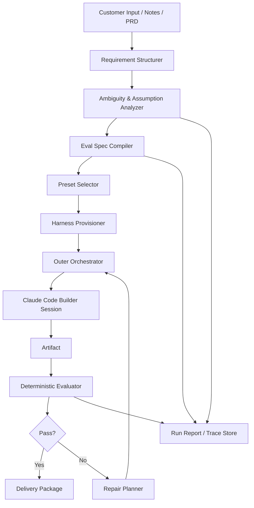

# FDE용 Preset-Driven Evaluation Harness Agent 설계 제안서

## 1. 문서 목적

이 문서는 FDE(Forward Deployed Engineer)가 고객 요구사항을 빠르게 프로토타입으로 전환할 때 사용할 수 있는 **Preset-Driven / Evaluation-Driven Agent System**의 설계 방향을 정리한다.

이 설계는 다음 세 가지 관점을 결합한다.

1. **FDE의 실제 업무 맥락**  
   FDE는 고객 현장에서 모호한 요구를 정리하고, 짧은 시간 안에 검증 가능한 프로토타입을 제시해야 한다.
2. **Harness Engineering 관점**  
   에이전트는 단순 생성기가 아니라, 특정 결과물 유형에 대해 생성·실행·검증·수정 루프를 반복 가능하게 만드는 실행 프레임 위에서 동작해야 한다.
3. **Claude Code Runtime 활용 관점**  
   Claude Code는 강력한 코딩 런타임이지만, 전체 시스템의 유일한 컨트롤러가 아니라 **Builder Runtime**으로 위치시키고, 바깥의 Orchestrator가 평가와 수렴을 제어하는 구조가 더 적합하다.

이 문서의 핵심 제안은 다음 한 문장으로 요약된다.

> **FDE 에이전트는 단순한 프로토타입 생성기가 아니라, 고객 요구사항을 검증 가능한 계약으로 변환하고, 적절한 preset/harness를 선택한 뒤, 그 계약을 만족할 때까지 산출물을 수렴시키는 시스템이다.**

---

## 2. 최종적으로 만들고 싶은 시스템

최종적으로 지향하는 사용자 경험은 매우 단순할 수 있다.

- 다양한 형태의 **템플릿(프리셋)** 을 미리 만들어 둔다.
  - 쇼핑몰 웹
  - 관리자 페이지 웹
  - 회사소개 웹
  - 리조트 예약 웹
  - 이후 모바일 앱, API, 데이터 파이프라인, 문서형 산출물까지 확장 가능
- FDE는 고객 요구사항을 분석한다.
- 에이전트는 그 요구사항을 구조화하고, **정량적 검증조건** 으로 변환한다.
- FDE는 Claude Code에게 겉보기에는 단순하게 다음처럼 지시할 수 있다.
  - `00 웹 만들어줘`
- 하지만 내부적으로는 단순 자연어 요청으로 처리하지 않고,
  - preset 선택
  - requirement schema 생성
  - eval spec 생성
  - Claude Code 실행
  - 검증 실행
  - 실패 원인 기반 수정
  - 재검증
  을 반복한다.
- 이 반복은 **검증조건을 만족할 때까지** 이어진다.

즉, 겉으로는 “웹 하나 만들어줘”처럼 보이지만, 실제 내부 구조는 **preset + eval-driven outer loop** 이다.

---

## 3. 핵심 결론

이 설계에서 가장 중요한 결론은 다음 세 가지다.

### 3.1 Preset(프리셋)은 단순 템플릿이 아니다
Preset은 단순 scaffold가 아니라, 특정 문제 유형에 최적화된 **실행 가능한 harness package** 다.

즉 preset 안에는 다음이 함께 포함되어야 한다.

- 기본 기술 스택
- 디렉터리 구조
- UI/도메인 기본 컴포넌트
- 기본 테스트 팩
- 기본 E2E 시나리오
- 기본 성능/접근성 기준
- Claude Code용 지시문 및 규칙
- 수정 루프에 필요한 가드레일

### 3.2 Claude Code는 전체 시스템이 아니라 Builder Runtime이다
Claude Code는 매우 강력한 실행 엔진이지만, 전체 흐름을 혼자 통제하도록 두기보다는 다음 역할에 집중시키는 것이 좋다.

- 코드 생성
- 파일 편집
- 테스트 수정
- 실패 원인 기반 patch 반영
- preset 내부 규칙을 따른 구현 작업

즉, Claude Code는 **Builder / Repair Executor** 역할에 매우 적합하다.

### 3.3 종료 조건은 Claude의 판단이 아니라 검증 통과다
“Claude가 다 만들었다고 말하는 것”이 종료가 아니다.

종료는 다음으로 판정해야 한다.

- Playwright 시나리오 통과
- Lighthouse 기준 충족
- Responsive snapshot 기준 충족
- Contract test 통과
- 필수 기능 시나리오 통과
- Hard constraint 모두 통과

즉, 이 시스템의 진짜 종료 조건은 **LLM의 자기 선언이 아니라 deterministic evaluation** 이다.

---

## 4. 왜 이런 시스템이 필요한가

FDE의 업무는 일반적인 제품 개발과 다르다. 고객이 처음부터 완성된 요구사항 문서를 제공하는 경우는 드물고, 실제 현장에서는 다음과 같은 상황이 반복된다.

- 요구사항이 모호하거나 상충된다.
- 고객은 문제를 설명하지만, 검증 기준은 명확히 말하지 못한다.
- FDE는 짧은 시간 안에 가설을 정리하고, 프로토타입을 만들고, 고객과 함께 검증해야 한다.
- 중요한 것은 “얼마나 많이 만들었는가”보다 “고객이 중요하게 여기는 기준을 만족했는가”이다.

따라서 FDE를 위한 에이전트는 단순히 코드를 생성하는 능력보다 아래 역량이 더 중요하다.

- 요구사항을 구조화하는 능력
- 모호한 요구를 검증 가능하게 번역하는 능력
- 결과물 유형에 따라 실행 환경과 테스트 환경을 빠르게 구성하는 능력
- 실패 원인을 분석하고 다음 수정 전략을 제안하는 능력
- 명확한 종료 조건 안에서 반복 개선을 수행하는 능력

---

## 5. 문제 정의

### 5.1 입력 문제
고객 요구사항은 보통 아래처럼 들어온다.

- “관리자가 쓰기 편해야 한다.”
- “반응 속도가 빨라야 한다.”
- “현업 프로세스에 맞아야 한다.”
- “모바일에서도 잘 보여야 한다.”
- “예약 과정이 직관적이어야 한다.”

이런 표현은 사람 사이의 커뮤니케이션에는 유용하지만, 자동화된 생성과 검증의 입력으로는 불충분하다.

### 5.2 생성 문제
결과물은 하나로 고정되지 않는다.

- 웹 프로토타입
- 모바일 앱 프로토타입
- API 서버
- 데이터 파이프라인
- 운영 문서 / 설계 문서 / 보고서

따라서 하나의 범용 생성기보다 **결과물 유형별 preset/harness 체계** 가 필요하다.

### 5.3 검증 문제
가장 중요한 문제는 생성 자체가 아니라 **검증의 부재** 다.  
프로토타입이 완성돼 보이더라도, 고객 요구를 만족하는지 객관적으로 말할 수 없다면 FDE 관점에서는 성공한 산출물이라 보기 어렵다.

따라서 핵심은 다음과 같다.

> **요구사항을 정량적 검증 규약으로 변환하고, 그 검증을 통과하지 못하면 수정 루프를 반복하는 구조를 시스템의 중심에 둔다.**

---

## 6. 설계 목표

### 6.1 핵심 목표

1. 고객 요구사항을 **구조화된 requirement schema** 로 변환한다.
2. 구조화된 요구사항을 **정량적 검증 규약(eval spec)** 으로 변환한다.
3. 결과물 유형별 **preset/harness** 를 자동 선택 또는 자동 구성한다.
4. Claude Code를 Builder Runtime으로 사용해 산출물을 생성/수정한다.
5. 산출물을 생성한 뒤 **실행 가능한 검증** 을 수행한다.
6. 실패한 항목에 대해 원인과 수정 전략을 도출하고 재생성/수정을 반복한다.
7. 최종적으로 FDE가 고객과 공유 가능한 결과물, 검증 리포트, 가정 목록, 미해결 항목을 제공한다.

### 6.2 비목표

다음은 이 시스템의 1차 비목표다.

- 모든 고객 요구를 완전 자동으로 해석하는 것
- 완전 무인 상태에서 프로덕션급 시스템을 바로 배포하는 것
- 사람의 판단 없이 UX/브랜드/법무/정책적 판단까지 100% 결정하는 것
- Claude Code 하나만으로 전체 워크플로를 완성하려고 하는 것

이 시스템의 목적은 “완전 자동화”보다 **FDE의 실행 속도와 설명 가능성을 높이는 것** 에 있다.

---

## 7. 핵심 설계 원칙

### 7.1 Requirement-first가 아니라 Evaluation-first
산출물 중심이 아니라 검증 중심으로 설계한다.

- 좋은 결과물 = 많이 만든 결과물
- 더 좋은 결과물 = **검증 가능한 요구를 만족한 결과물**

즉, 생성기는 코어가 아니다.  
코어는 **요구사항을 평가 규약으로 바꾸는 계층** 이다.

### 7.2 Preset은 “결과물 유형 × 고객 문제 유형” 단위로 본다
예를 들어 웹 preset 하나만 두는 것은 부족하다.

- 관리자 페이지 웹 preset
- 쇼핑몰 웹 preset
- 회사소개 웹 preset
- 리조트 예약 웹 preset

같은 웹이어도 문제 유형과 핵심 플로우가 다르기 때문에 preset도 달라져야 한다.

### 7.3 Harness는 “결과물 유형 × 검증 목적” 단위로 본다
예를 들어 관리자 웹 preset 안에서도 검증 목적에 따라 harness가 달라진다.

- 기능 구현 harness
- UI 검증 harness
- API 계약 검증 harness
- E2E 시나리오 harness
- 성능 검증 harness
- 접근성 검증 harness
- 보안/정적 분석 harness

따라서 harness는 단순한 개발 환경 세팅이 아니라, **특정 산출물 유형에 대해 특정 검증을 가능하게 하는 실행 프레임** 으로 정의하는 것이 적절하다.

### 7.4 가능한 한 실행 가능한 검증을 우선한다
LLM 평가만으로는 편향이나 자기합리화가 생길 수 있다.  
따라서 평가는 우선순위를 다음처럼 둔다.

1. 실행 가능한 테스트
2. 정적 분석 / 계측 기반 점검
3. 휴리스틱 기반 점수화
4. 마지막 보조 수단으로 LLM 평가

### 7.5 생성자와 평가자를 분리한다
한 모델이 만들고 같은 모델이 평가하면 평가가 느슨해질 수 있다.  
따라서 최소한 개념적으로는 아래 역할을 분리한다.

- **Builder**: 산출물 생성/수정
- **Evaluator**: 테스트 실행, 채점, 실패 원인 도출
- **Orchestrator**: 루프 제어, 예산 제어, 상태 관리

### 7.6 모호성은 숨기지 말고 명시적으로 처리한다
FDE 업무에서는 모호성을 제거하는 능력이 중요하다.  
따라서 에이전트는 모호한 요구사항을 무시하지 말고 다음 중 하나로 분류해야 한다.

- 검증 가능한 규약으로 번역 가능
- 가정이 필요함
- 고객 확인이 필요함
- 현재 데이터/환경으로는 검증 불가

### 7.7 루프는 무한 반복이 아니라 수렴 제어가 있어야 한다
“통과할 때까지 계속 루프”는 이상적으로 맞지만, 실제 시스템은 다음을 함께 가져야 한다.

- 품질 종료 조건
- 시간/비용/토큰 예산
- 개선 폭 기반 수렴 조건
- 사람 개입이 필요한 escalation 조건

### 7.8 Claude Code는 Builder로 두고, 바깥에서 Outer Loop를 제어한다
이 원칙이 이번 설계 보강에서 가장 중요하다.

Claude Code에게 단순히 “끝날 때까지 알아서 해”라고 맡기기보다, 바깥의 Orchestrator가 다음을 책임져야 한다.

- preset 선택
- requirement schema 생성
- eval spec 생성
- Claude Code 실행 입력 구성
- 평가 실행
- 재시도 여부 판단
- 다음 iteration 계약 생성
- 최종 종료 판단

---

## 8. 전체 시스템 정의

### 8.1 시스템의 한 줄 정의

> **FDE용 Preset-Driven Evaluation Harness Agent는 고객 요구사항을 분석해 정량적 검증 규약으로 변환하고, 적절한 preset/harness를 선택한 뒤, Claude Code 기반 Builder를 외부 평가 루프로 반복 실행하여 고객 요구를 만족하는 프로토타입을 수렴시키는 시스템이다.**

### 8.2 시스템이 다루는 대상

- 입력: 고객 인터뷰 메모, 회의록, PRD 초안, 기능 목록, UI 목업, 경쟁 서비스 예시, 운영 제약 조건
- 출력: 프로토타입, 실행 환경, 테스트 결과, 검증 리포트, 가정 목록, 미해결 항목 목록

---

## 9. 상위 아키텍처



### 9.1 핵심 해석

이 구조에서 중요한 점은 다음이다.

- Claude Code는 `H`에 위치한다.
- 핵심 제어권은 `G(Outer Orchestrator)` 에 있다.
- 진짜 종료 판정은 `J(Deterministic Evaluator)` 가 내린다.
- `M(Repair Planner)` 는 실패를 다음 iteration 작업 계약으로 번역한다.

즉, 이 시스템은 “Claude Code가 혼자 끝내는 구조”가 아니라, **Claude Code를 루프 안의 Builder로 사용하는 구조** 다.

---

## 10. 전체 시스템에서 Claude Code의 역할

### 10.1 Claude Code에게 맡기기 좋은 것

- preset 내부 코드베이스 이해
- scaffold 생성 및 파일 수정
- 반복적 리팩토링
- 테스트 실패 원인 반영
- UI/도메인 구현
- 문서/주석/스크립트 생성
- patch 단위 수정

### 10.2 Claude Code에게 직접 맡기면 불안정한 것

- 최종 종료 판단
- 품질 목표의 절대 판정
- 전체 예산 제어
- 요구사항 변경 이력 관리
- 평가 결과의 권위 있는 판정
- 고객 확인이 필요한 모호성 해소

### 10.3 따라서 내리는 설계 결정

> **Claude Code는 Builder Runtime으로 둔다.**

다시 말해, Claude Code는 핵심 엔진이지만 시스템의 유일한 오케스트레이터는 아니다.

---

## 11. Preset System 설계

### 11.1 Preset의 정의

Preset은 단순 boilerplate가 아니다.

> **Preset은 특정 고객 문제 유형에 대해, 빠르게 출발하고 반복 검증까지 가능한 상태로 묶은 실행 패키지다.**

### 11.2 Preset이 포함해야 하는 요소

각 preset은 최소한 아래를 포함해야 한다.

#### 1) Scaffold
- 디렉터리 구조
- 패키지 설정
- 공통 컴포넌트
- 도메인 예제 모델

#### 2) Claude Code 운영 규칙
- `CLAUDE.md`
- `.claude/settings.json`
- `.claude/agents/` 또는 역할별 지시문
- hook 설정
- 허용된 실행 명령/보호 파일 규칙

#### 3) Test Pack
- 기본 Playwright 시나리오
- responsive snapshot 규칙
- Lighthouse 기준
- console error 검사
- contract test 또는 mock test

#### 4) Data & Fixtures
- seed 데이터
- mock API 응답
- 테스트 계정
- 예제 업로드 파일

#### 5) Domain Rules
- 예약 도메인 규칙
- 상품 목록/장바구니 플로우
- 관리자 CRUD 패턴
- 기업 소개형 정보 구조 규칙

### 11.3 Preset Catalog 예시

| preset_id | 설명 | 기본 핵심 플로우 | 기본 검증 팩 |
|---|---|---|---|
| admin-web | 관리자/운영용 내부 웹 | 로그인, 목록, 상세, 수정, 저장, 권한 | Playwright, responsive, console, a11y |
| ecommerce-web | 쇼핑몰 웹 | 홈, 카테고리, 상세, 장바구니, 주문 | Playwright, perf, responsive, checkout flow |
| corporate-site | 회사소개 웹 | 홈, 소개, 서비스, 문의 | responsive, Lighthouse, copy QA |
| resort-booking-web | 리조트 예약 웹 | 검색, 객실 선택, 예약, 결제 직전 | booking scenario, mobile flow, perf |

### 11.4 중요한 운영 원칙

Preset은 많아질수록 좋지 않다.  
초기에는 소수의 preset을 깊게 만드는 것이 중요하다.

초기 권장 순서:

1. `admin-web`
2. `corporate-site`
3. `resort-booking-web`
4. `ecommerce-web`

---

## 12. 핵심 개념: Requirements-to-Eval Compiler

이 시스템의 진짜 핵심은 코드 생성기가 아니라 **Requirements-to-Eval Compiler** 다.

즉, 입력으로 받은 고객 요구를 다음처럼 바꾼다.

### 12.1 예시: 모호한 요구 → 검증 가능한 요구

| 원문 요구 | 변환된 운영 정의 | 검증 방식 |
|---|---|---|
| 관리자가 쓰기 편해야 한다 | 신규 등록 핵심 작업을 3클릭 이내에 완료 가능 | E2E task test |
| 응답이 빨라야 한다 | 주요 조회 API p95 latency 800ms 이하 | 성능 테스트 |
| 모바일에서도 잘 보여야 한다 | 390px 뷰포트에서 핵심 CTA가 first fold 내 노출 | 반응형 UI 검사 |
| 현업 프로세스에 맞아야 한다 | 엑셀 업로드 후 1분 내 유효성 검사 및 실패 사유 표기 | 시나리오 테스트 |
| 예약 플로우가 직관적이어야 한다 | 첫 방문 사용자가 예약 완료 직전 단계까지 2분 내 도달 가능 | scripted task completion |

### 12.2 중요한 포인트

요구사항을 “이해”하는 것보다 더 중요한 것은 **검증 가능하게 operationalize 하는 것** 이다.  
이 단계가 부실하면 이후 preset 선택, harness 구성, 생성, 수정 루프 모두 흔들린다.

---

## 13. 정량적 검증 설계

### 13.1 평가 항목의 계층

모든 요구를 동일한 강도로 다루면 안 된다. 평가 항목은 다음처럼 계층화하는 것이 좋다.

#### Hard Constraints
반드시 통과해야 하는 항목

예:
- 로그인 실패 시 보안 정책 준수
- 핵심 CRUD 시나리오 성공
- 필수 API contract 일치
- 결제 직전까지 예약 플로우 중단 없이 진행 가능

#### Soft Goals
최대한 높여야 하는 항목

예:
- p95 latency 800ms 이하
- 초기 로딩 시간 단축
- task completion score 향상
- Lighthouse performance 80 이상

#### Preferences
있으면 좋은 선호 조건

예:
- 디자인 톤 앤 매너
- 카피라이팅 스타일
- 정보 밀도 선호
- 카드형 UI 선호

### 13.2 Eval Spec에 포함될 필드

각 검증 규약은 최소한 다음 필드를 가져야 한다.

- `requirement_id`
- `title`
- `type`
- `metric`
- `threshold`
- `severity`
- `test_method`
- `data_setup`
- `owner`
- `retry_policy`
- `evidence`
- `applies_to_preset`
- `blocking`

### 13.3 예시 Eval Spec (YAML)

```yaml
project: customer-admin-prototype
artifact_type: web
preset: admin-web
requirements:
  - requirement_id: FR-001
    title: 신규 고객 등록 가능
    type: functional
    metric: e2e_task_success
    threshold: "100%"
    severity: hard
    blocking: true
    test_method: playwright_scenario
    data_setup: seeded_admin_account
    evidence: [video, screenshot, console_log]

  - requirement_id: NFR-001
    title: 고객 목록 조회 응답 속도
    type: performance
    metric: p95_latency_ms
    threshold: "<=800"
    severity: soft
    blocking: false
    test_method: api_benchmark
    data_setup: 1000_seeded_customers
    evidence: [latency_report]

  - requirement_id: UX-001
    title: 모바일에서 핵심 CTA 노출
    type: ux
    metric: cta_visible_above_fold
    threshold: true
    severity: soft
    blocking: false
    test_method: responsive_snapshot_check
    data_setup: iphone12_viewport
    evidence: [screenshot]
```

---

## 14. Claude Code에 실제로 전달해야 하는 입력 계약

겉보기 사용자 경험은 다음처럼 단순할 수 있다.

- `00 웹 만들어줘`

하지만 실제 내부적으로 Claude Code에 넘겨야 하는 입력은 훨씬 구조화되어야 한다.

### 14.1 잘못된 접근

- “예쁜 관리자 페이지 만들어줘”
- “리조트 예약 웹사이트 하나 만들어줘”
- “쇼핑몰 느낌으로 구성해줘”

이 방식은 데모는 만들 수 있지만, 검증 가능한 종료 구조를 만들기 어렵다.

### 14.2 권장 접근

Claude Code에는 다음과 같은 **작업 계약(Task Contract)** 을 넘긴다.

```yaml
run_id: run_2026_04_10_001
preset: resort-booking-web
goal: 고객용 리조트 예약 웹 프로토타입 생성
current_iteration: 3
workspace: /workspace/projects/resort-booking-demo
requirements:
  - id: FR-001
    text: 사용자는 날짜와 인원 수를 선택해 예약 가능한 객실 목록을 볼 수 있어야 한다.
  - id: FR-002
    text: 사용자는 모바일에서 객실 상세와 예약 CTA를 쉽게 확인할 수 있어야 한다.
constraints:
  - React + TypeScript 사용
  - mock API 기반으로 동작
  - 다국어는 이번 범위 제외
failing_checks:
  - UX-001 mobile CTA below fold
  - PERF-001 lighthouse perf score 73
repair_priority:
  - mobile CTA visibility fix first
  - reduce image payload on landing page
protected_files:
  - package-lock.json
  - design-tokens.json
expected_output:
  - code changes
  - updated tests
  - summary of what changed
```

### 14.3 핵심 포인트

즉, Claude Code는 “모호한 원문 요구”를 직접 받는 것이 아니라, **정제된 작업 계약** 을 받는 구조가 더 적절하다.

---

## 15. Harness Engineering 정의

### 15.1 Harness란 무엇인가
이 문맥에서 harness는 단순한 개발 템플릿이나 boilerplate가 아니다.

> **Harness는 특정 산출물 유형에 대해, 생성·실행·검증·계측·수정이 반복 가능하도록 만드는 실행 프레임이다.**

### 15.2 Harness가 포함해야 하는 요소
모든 harness는 최소한 아래 계약을 가져야 한다.

#### 공통 입력
- requirement schema
- eval spec
- 기술 제약 조건
- 디자인/브랜드 제약 조건
- 테스트 데이터 또는 시드 데이터

#### 공통 실행 구성
- 런타임 및 의존성
- 빌드 명령
- 실행 명령
- 테스트 명령
- 리포트 수집 방법
- 로그 수집 방법

#### 공통 출력
- 산출물 파일
- 테스트 결과
- 성능 지표
- 스냅샷 / 스크린샷 / 로그
- 실패 원인
- 다음 수정 제안

### 15.3 Harness 분류 체계
Harness는 두 축으로 분류할 수 있다.

#### 축 1: 결과물 유형
- Web Prototype Harness
- Mobile App Harness
- Backend/API Harness
- Data Workflow Harness
- Document / Proposal Harness

#### 축 2: 검증 목적
- Functional Harness
- Contract Harness
- E2E Harness
- Accessibility Harness
- Performance Harness
- Security/Static Analysis Harness
- UX Heuristic Harness

즉, 실제 시스템에서는 하나의 산출물이 여러 harness 조합을 사용할 수 있다.

---

## 16. Ralph-style Outer Loop 설계

### 16.1 개념

여기서 말하는 Ralph-style loop는 “에이전트가 한 번 생성하고 끝나는 구조”가 아니라, **외부 평가 결과를 기준으로 다시 작업 계약을 만들어 반복 실행하는 outer loop** 를 의미한다.

중요한 점은 이것이 Claude Code의 단일 내장 기능이라기보다, **Claude Code를 포함한 Builder Runtime 바깥에서 구현하는 반복 제어 패턴** 이라는 점이다.

### 16.2 기본 루프

```text
1. 요구사항 구조화
2. Eval Spec 생성
3. Preset 선택 및 환경 구성
4. Claude Code Builder 실행
5. Deterministic evaluator 실행
6. 실패 requirement_id 및 evidence 수집
7. Repair plan 생성
8. 다음 iteration task contract 생성
9. Claude Code 재실행
10. 재검증
11. 종료 또는 escalation
```

### 16.3 왜 Outer Loop가 필요한가

Claude Code 내부에서 어느 정도 반복은 가능하더라도, 다음 항목은 바깥에서 제어하는 것이 더 적절하다.

- iteration budget
- global convergence condition
- run-level reporting
- artifact history
- multi-session coordination
- preset 전환 여부 판단
- 사람 escalation

### 16.4 의사코드 예시

```python
while not termination_reached:
    task_contract = build_task_contract(
        preset=selected_preset,
        requirements=requirement_schema,
        eval_spec=eval_spec,
        previous_failures=latest_failures,
        repair_plan=repair_plan,
    )

    run_claude_code_builder(task_contract)

    eval_results = run_deterministic_evaluators()

    if all_hard_constraints_pass(eval_results) and soft_score_ok(eval_results):
        break

    if exceeded_budget() or no_meaningful_improvement(eval_results):
        escalate_to_fde()
        break

    repair_plan = build_repair_plan(eval_results)
```

---

## 17. Claude Code Runtime 연동 전략

### 17.1 운영 모드 구분

이 시스템에서 Claude Code는 세 가지 방식으로 활용할 수 있다.

#### 1) Interactive Mode
FDE가 로컬에서 직접 대화형으로 사용하는 방식

적합한 상황:
- discovery 단계
- 초기 prototype ideation
- 현장 데모 직전 빠른 수정

#### 2) Headless / CLI Mode
스크립트나 CI 환경에서 Claude Code를 비대화형으로 실행하는 방식

적합한 상황:
- outer loop 반복 실행
- test-fix-run 사이클 자동화
- batch run

#### 3) Agent SDK Mode
Python/TypeScript에서 Claude Code의 agent loop를 프로그래밍적으로 제어하는 방식

적합한 상황:
- 정교한 orchestrator 구현
- run-level state 관리
- 다중 세션 / 다중 subagent 제어
- preset 시스템의 제품화

### 17.2 추천 전략

- **초기 MVP**: Headless CLI + 간단한 orchestrator
- **중기 발전형**: Agent SDK 기반 orchestrator
- **장기 제품형**: preset registry + eval platform + trace store 결합

### 17.3 Claude Code 기능을 어디에 쓸 것인가

#### `CLAUDE.md`
- preset별 고정 규칙
- 구현 스타일
- 도메인 제약
- 작업 우선순위

#### `.claude/settings.json`
- 권한 정책
- hook 설정
- 실행 허용 도구 제한
- 프로젝트 공유 설정

#### Subagents
- 코드 리뷰 서브에이전트
- 테스트 분석 서브에이전트
- UX heuristic 서브에이전트

#### Hooks
- 특정 파일 수정 차단
- formatter 자동 실행
- 테스트 전/후 검증
- audit logging
- 특정 실패 시 자동 report 수집

### 17.4 실무적 해석

Claude Code의 확장 포인트는 많지만, 이 설계에서는 모두 “Builder quality를 높이는 수단”으로 사용한다.  
시스템의 근본적인 종료 조건과 iteration 제어는 outer orchestrator가 담당한다.

---

## 18. Web Harness 예시

웹 프로토타입을 위한 harness는 다음과 같은 구성을 가질 수 있다.

### 18.1 목표
- 관리자/사용자 플로우가 실제 클릭 가능한 형태로 동작해야 한다.
- 핵심 페이지의 반응형 UI가 유지돼야 한다.
- 주요 API 연동 또는 mock 데이터 기반 흐름이 재현돼야 한다.
- 성능/접근성 최소 기준을 만족해야 한다.

### 18.2 구성 요소
- 프로젝트 scaffold 생성기
- 프론트엔드 런타임 및 패키지 매니저
- 디자인 시스템 또는 UI 컴포넌트 템플릿
- mock API 또는 실제 API 스텁
- E2E 테스트 러너
- Lighthouse / 접근성 검사 도구
- 스냅샷 비교 도구
- 성능 계측기

### 18.3 예시 검증 항목
- 로그인, 목록 조회, 상세 조회, 수정, 저장 플로우 정상 동작
- 폼 유효성 검사 문구 노출
- 390px / 768px / 1440px 뷰포트 레이아웃 통과
- 주요 화면 Lighthouse performance 80 이상
- 접근성 최소 점수 충족
- 치명적 콘솔 에러 없음

---

## 19. Mobile App Harness 예시

앱 harness는 웹과 일부 유사하지만, 다음 차이를 고려해야 한다.

### 19.1 추가 고려 요소
- 플랫폼(iOS / Android) 차이
- 네이티브 권한 처리
- 오프라인/불안정 네트워크 상황
- 앱 설치/실행/전환 흐름
- 디바이스 크기와 해상도 다양성

### 19.2 검증 예시
- 첫 실행 온보딩 완료율
- 네트워크 실패 시 재시도 UX
- 주요 화면 렌더링 시간
- 터치 타겟 최소 크기
- 딥링크 동작 여부
- 크래시 없는 정상 플로우 비율

---

## 20. Example: “00 웹 만들어줘”가 내부적으로 어떻게 처리되는가

### 20.1 FDE가 보는 인터페이스

- `00 웹 만들어줘`

### 20.2 내부 처리 흐름

1. intent parser가 `artifact_type=web` 로 분류
2. 고객 맥락과 요구사항을 읽고 `preset=admin-web` 또는 `preset=resort-booking-web` 선택
3. requirement schema 생성
4. eval spec 생성
5. workspace provisioning
6. Claude Code Builder session 실행
7. Playwright / Lighthouse / responsive evaluator 실행
8. 실패 항목 추출
9. repair planner가 다음 iteration task contract 생성
10. Claude Code 재실행
11. hard constraint 통과 시 종료

### 20.3 중요한 해석

즉, 사용자 경험은 단순하지만 실제 시스템은 **LLM chatting** 이 아니라 **contract-driven build/eval loop** 로 동작한다.

---

## 21. 데이터 모델 초안

### 21.1 Requirement Schema

```json
{
  "requirement_id": "FR-001",
  "source": "customer_interview",
  "raw_text": "관리자가 쉽게 신규 고객을 등록할 수 있어야 한다",
  "normalized_text": "관리자는 신규 고객 등록 플로우를 짧은 단계로 완료할 수 있어야 한다",
  "category": "functional",
  "priority": "high",
  "ambiguity_level": "medium",
  "assumptions": [
    "easy는 3클릭 이내로 operationalize"
  ],
  "needs_customer_confirmation": true
}
```

### 21.2 Eval Result Schema

```json
{
  "run_id": "run_2026_04_10_001",
  "requirement_id": "FR-001",
  "status": "failed",
  "metric": "e2e_task_success",
  "observed_value": "0%",
  "expected_value": "100%",
  "severity": "hard",
  "failure_reason": "저장 버튼 클릭 후 validation error 처리가 누락됨",
  "repair_hint": "필수 필드 validation 및 오류 메시지 렌더링 추가",
  "evidence": [
    "artifacts/videos/register-flow.mp4",
    "artifacts/screenshots/register-error.png"
  ]
}
```

### 21.3 Task Contract Schema

```json
{
  "run_id": "run_2026_04_10_001",
  "preset": "admin-web",
  "iteration": 2,
  "workspace": "/workspace/customer-admin",
  "goal": "고객 관리자 웹 프로토타입 생성",
  "requirements": ["FR-001", "FR-002", "UX-001"],
  "failing_checks": ["UX-001"],
  "repair_priority": ["UX-001 first"],
  "constraints": ["mock API only", "mobile support required"],
  "protected_files": ["design-tokens.json"],
  "expected_output": ["code changes", "test updates", "change summary"]
}
```

---

## 22. 예시 시나리오

### 22.1 고객의 원문 요구
고객사는 “영업 운영팀이 신규 리드를 빠르게 등록하고 상태를 관리할 수 있는 관리자 웹”을 원한다.

추가 요구는 아래와 같다.

- 모바일에서도 봐야 한다.
- 너무 느리면 안 된다.
- 현업이 엑셀 업로드를 많이 쓴다.
- 권한별로 메뉴가 달라야 한다.

### 22.2 구조화된 요구
- 관리자 로그인 필요
- 신규 리드 등록 가능
- 엑셀 업로드 기반 일괄 등록 가능
- 권한별 메뉴 노출 제어
- 모바일 뷰포트 지원
- 주요 목록 조회 성능 목표 존재

### 22.3 Eval Spec 예시
- 로그인 성공/실패 시나리오 통과
- 신규 리드 등록 E2E 100% 성공
- 엑셀 업로드 후 1분 내 처리 완료
- 역할(role)별 메뉴 노출 규칙 일치
- 390px 뷰포트에서 핵심 CTA 노출
- 목록 조회 API p95 800ms 이하

### 22.4 Preset 선택
이 요구는 `admin-web` preset이 기본 후보가 된다.

### 22.5 Loop 예시
1. Builder가 초기 관리자 웹 생성
2. Evaluator가 E2E와 반응형 테스트 수행
3. 모바일에서 CTA가 fold 아래로 내려가 실패
4. Repair Planner가 레이아웃 우선 수정 제안
5. Outer Orchestrator가 iteration 2 task contract 생성
6. Claude Code가 UI 수정
7. 재검증 후 반응형 항목 통과
8. 성능 항목 실패 시 API pagination / caching 개선
9. 모든 hard 항목 통과 시 결과물과 리포트 패키징

---

## 23. 운영상 리스크와 대응

### 23.1 리스크: 요구사항 자체가 검증 불가능함
예: “세련돼야 한다”, “직관적이어야 한다”  

**대응**
- operational definition 제안
- 휴리스틱 평가로 다운그레이드
- 고객 확인 필요 항목으로 승격

### 23.2 리스크: 같은 모델이 생성과 평가를 모두 맡아 자기합리화함
**대응**
- 역할 분리
- 실행 가능한 테스트 우선
- 독립된 evaluator 정책 사용

### 23.3 리스크: 루프가 무한히 길어짐
**대응**
- 반복 횟수 제한
- 개선 폭 측정
- 실패 이유 유형화 후 escalation

### 23.4 리스크: preset이 파편화되고 중복이 많아짐
**대응**
- 공통 preset contract 정의
- 공통 validator pack 재사용
- preset registry 운영
- domain-specific layer와 infra layer 분리

### 23.5 리스크: Claude Code 세션 상태에 지나치게 의존함
**대응**
- session 외부 state 저장
- eval spec / task contract를 파일 및 run store에 보존
- 세션 재생성 가능 구조 유지

### 23.6 리스크: 고객 요구가 계속 바뀜
**대응**
- requirement versioning
- eval spec versioning
- 어떤 버전 기준으로 통과했는지 trace 저장

---

## 24. 권장 시스템 운영 모델

### 24.1 역할 분리
- **FDE**: 고객 요구 정제, 우선순위 조정, 가정 승인
- **Requirement Compiler**: 자연어 요구 구조화
- **Eval Compiler**: 정량 검증 규약 생성
- **Preset Selector**: 가장 적합한 preset 추천
- **Outer Orchestrator**: 루프 제어, 예산 관리, run 상태 관리
- **Claude Code Builder**: 생성/수정 실행
- **Deterministic Evaluator**: pass/fail 판정
- **Repair Planner**: 다음 iteration 전략 수립
- **고객**: 모호한 요구 확정, trade-off 승인

### 24.2 FDE가 실제로 얻게 되는 가치
- 요구사항 정리 속도 향상
- 검증 기준이 명확한 프로토타입 생성
- 고객과의 합의 비용 절감
- 데모 품질의 일관성 향상
- 실패 원인과 미해결 항목의 투명성 확보
- Claude Code를 더 통제된 방식으로 활용 가능

---

## 25. MVP 범위 제안

처음부터 모든 결과물 유형을 지원하기보다, 아래 순서로 시작하는 것이 현실적이다.

### Phase 1: Web Prototype 중심 MVP
- `admin-web` preset
- `corporate-site` preset
- Requirement Structurer
- Eval Spec Compiler
- Headless Claude Code Builder
- Playwright / responsive / Lighthouse / console check
- 수정 루프 및 리포트 생성

### Phase 2: Preset 확장
- `resort-booking-web` preset
- `ecommerce-web` preset
- domain-specific flow pack 추가
- screenshot diff / booking scenario evaluator 확장

### Phase 3: Backend/API Harness 확장
- OpenAPI contract 검증
- 부하 테스트
- 인증/권한 테스트

### Phase 4: Mobile App Harness 확장
- 화면 흐름 검증
- 디바이스 조건 검증
- 앱 성능/크래시 기준 반영

### Phase 5: Multi-artifact Orchestration
- 웹 + API + 문서 + 데이터 workflow를 하나의 프로젝트 안에서 동시 관리
- cross-artifact dependency 추적

---

## 26. 가장 현실적인 초기 구현안

초기 버전에서는 다음처럼 시작하는 것이 가장 실용적이다.

### 26.1 기술적 형태
- Python 또는 TypeScript Orchestrator
- Claude Code headless 실행
- preset별 workspace scaffold
- Playwright + Lighthouse 기반 evaluator
- JSON/YAML 기반 run artifacts 저장

### 26.2 왜 이 구성이 좋은가
- 너무 많은 복잡성을 한 번에 넣지 않아도 된다.
- Claude Code의 강점을 바로 활용할 수 있다.
- preset과 eval pack이 구조의 중심이 된다.
- 이후 Agent SDK 기반으로 확장하기 쉽다.

### 26.3 MVP 성공 기준
- preset 2개 이상 동작
- hard constraint 기준으로 종료 판단 가능
- 최소 2회 이상 patch/eval 루프가 자동으로 동작
- FDE가 리포트를 고객과 공유할 수 있음

---

## 27. 최종 제안

정리하면, 우리가 만들고자 하는 FDE용 에이전트는 아래 특징을 가져야 한다.

1. 고객의 자연어 요구사항을 그대로 Claude Code 입력으로 쓰지 않는다.  
   먼저 구조화하고 operationalize 한다.

2. 결과물 생성보다 **정량적 검증 규약 생성** 을 더 핵심 기능으로 본다.

3. preset은 단순 템플릿이 아니라, **생성·실행·검증·수정이 반복 가능한 문제유형별 실행 패키지** 로 정의한다.

4. Claude Code는 전체 시스템이 아니라 **Builder Runtime** 으로 정의한다.

5. 외부 Orchestrator가 Ralph-style outer loop를 돌면서,
   - iteration 관리
   - 평가 결과 수집
   - repair plan 생성
   - 재실행 여부 판단
   을 수행한다.

6. 생성과 평가는 분리하고, 가능하면 실행 가능한 테스트를 우선한다.

7. 통과하지 못한 요구는 실패 원인과 함께 다시 수정 루프로 보내고, 루프는 품질·예산·수렴 조건 아래에서 제어한다.

8. 최종 산출물은 코드나 화면만이 아니라, **검증 리포트, 가정 목록, 미해결 항목, 고객 확인 포인트** 까지 포함해야 한다.

---

## 28. 결론

이 설계의 본질은 매우 명확하다.

> **FDE 에이전트는 프로토타입을 잘 만드는 에이전트가 아니라, 고객 요구사항을 검증 가능한 계약으로 바꾸고, 적절한 preset을 선택한 뒤, 그 계약을 만족할 때까지 Claude Code 기반 산출물을 수렴시키는 에이전트다.**

따라서 harness engineering에서 가장 중요한 포인트를 하나만 고르자면, 그것은 단순한 환경 자동화가 아니라 다음이다.

> **요구사항 → 정량적 검증 규약 → preset/harness 선택 → Claude Code Builder 실행 → deterministic evaluation → repair loop** 를 끊기지 않게 연결하는 것이다.

이 구조가 갖춰지면 FDE는 더 빠르게 고객 요구를 구조화할 수 있고, 더 짧은 시간 안에, 더 설명 가능한 방식으로, 더 신뢰할 수 있는 프로토타입을 제시할 수 있다.

---

## 29. 다음 단계 제안

실제 설계로 이어가려면 다음 네 가지를 먼저 고정하는 것이 좋다.

1. **Requirement Schema**  
   어떤 형식으로 고객 요구를 구조화할 것인가

2. **Eval Spec Schema**  
   어떤 형식으로 정량적 검증 규약을 표현할 것인가

3. **Preset Contract**  
   각 preset이 어떤 입력/구성/검증팩을 가져야 하는가

4. **Task Contract Schema**  
   Outer Orchestrator가 Claude Code Builder에게 어떤 형식으로 작업을 넘길 것인가

이 네 가지가 고정되면, 이후 `admin-web`, `corporate-site`, `resort-booking-web` 같은 preset을 점진적으로 추가하면서 시스템을 확장할 수 있다.
